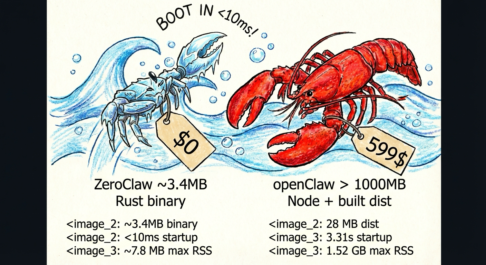

<p align="center">
  
</p>

<h1 align="center">ZeroClaw 🦀</h1>

<p align="center">
  <strong>Sobrecarga zero. Compromisso zero. 100% Rust. 100% Agnóstico.</strong><br>
  ⚡️ <strong>Funciona em qualquer hardware com <5MB RAM: 99% menos memória que OpenClaw e 98% mais barato que um Mac mini!</strong>
</p>

<p align="center">
  <a href="../../../LICENSE-APACHE"></a>
  <a href="../../../NOTICE"></a>
  <a href="https://buymeacoffee.com/argenistherose"></a>
  <a href="https://x.com/zeroclawlabs?s=21"></a>
  <a href="https://zeroclawlabs.cn/group.jpg"></a>
  <a href="https://www.xiaohongshu.com/user/profile/67cbfc43000000000d008307?xsec_token=AB73VnYnGNx5y36EtnnZfGmAmS-6Wzv8WMuGpfwfkg6Yc%3D&xsec_source=pc_search"></a>
  <a href="https://t.me/zeroclawlabs"></a>
  <a href="https://www.facebook.com/groups/zeroclaw"></a>
  <a href="https://www.reddit.com/r/zeroclawlabs/"></a>
</p>
<p align="center">
Desenvolvido por estudantes e membros das comunidades de Harvard, MIT e Sundai.Club.
</p>

<p align="center">
  🌐 <strong>Idiomas:</strong> <a href="../../../README.md">English</a> · <a href="../zh-CN/README.md">简体中文</a> · <a href="../es/README.md">Español</a> · <a href="README.md">Português</a> · <a href="../it/README.md">Italiano</a> · <a href="../ja/README.md">日本語</a> · <a href="../ru/README.md">Русский</a> · <a href="../fr/README.md">Français</a> · <a href="../vi/README.md">Tiếng Việt</a> · <a href="../el/README.md">Ελληνικά</a>
</p>

<p align="center">
  <a href="#início-rápido">Início Rápido</a> |
  <a href="../../../docs/one-click-bootstrap.md">Configuração com Um Clique</a> |
  <a href="../../../docs/README.md">Hub de Docs</a> |
  <a href="../../../docs/SUMMARY.md">TOC de Docs</a>
</p>

<p align="center">
  <strong>Rotas Rápidas:</strong>
  <a href="../../../docs/reference/README.md">Referência</a> ·
  <a href="../../../docs/operations/README.md">Operações</a> ·
  <a href="../../../docs/troubleshooting.md">Solução de Problemas</a> ·
  <a href="../../../docs/security/README.md">Segurança</a> ·
  <a href="../../../docs/hardware/README.md">Hardware</a> ·
  <a href="../../../docs/contributing/README.md">Contribuir</a>
</p>

<p align="center">
  <strong>Framework rápido, pequeno e totalmente autônomo</strong><br />
  Implante em qualquer lugar. Troque qualquer coisa.
</p>

<p align="center">
  ZeroClaw é o <strong>framework de runtime</strong> para fluxos de trabalho agentes — infraestrutura que abstrai modelos, ferramentas, memória e execução para que agentes possam ser construídos uma vez e executados em qualquer lugar.
</p>

<p align="center"><code>Arquitetura baseada em traits · runtime seguro por padrão · provedor/canal/ferramenta trocável · tudo conectável</code></p>

### 📢 Anúncios

Use este quadro para avisos importantes (mudanças disruptivas, avisos de segurança, janelas de manutenção e bloqueios de releases).

| Data (UTC) | Nível       | Aviso                                                                                                                                                                                                                                                                                                                                                 | Ação                                                                                                                                                                                                                                                                                                                                                                                                                                                                                                                                                                                                              |
| ---------- | ----------- | ------------------------------------------------------------------------------------------------------------------------------------------------------------------------------------------------------------------------------------------------------------------------------------------------------------------------------------------------------ | --------------------------------------------------------------------------------------------------------------------------------------------------------------------------------------------------------------------------------------------------------------------------------------------------------------------------------------------------------------------------------------------------------------------------------------------------------------------------------------------------------------------------------------------------- |
| 2026-02-19 | _Crítico_   | **Não somos afiliados** com `openagen/zeroclaw`, `zeroclaw.org` ou `zeroclaw.net`. Os domínios `zeroclaw.org` e `zeroclaw.net` atualmente apontam para o fork `openagen/zeroclaw`, e esse domínio/repositório estão representando nosso site/projeto oficial.                                                                                       | Não confie em informações, binários, arrecadação de fundos ou anúncios dessas fontes. Use apenas [este repositório](https://github.com/zeroclaw-labs/zeroclaw) e nossas contas sociais verificadas.                                                                                                                                                                                                                                                                                                                                                                                                                       |
| 2026-02-21 | _Importante_ | Nosso site oficial agora está disponível: [zeroclawlabs.ai](https://zeroclawlabs.ai). Obrigado pela paciência enquanto preparamos o lançamento. Ainda estamos vendo tentativas de representação, então **não** participe de nenhuma atividade de investimento ou arrecadação de fundos reivindicando o nome ZeroClaw a menos que seja publicado através de nossos canais oficiais.                            | Use [este repositório](https://github.com/zeroclaw-labs/zeroclaw) como a única fonte de verdade. Siga [X (@zeroclawlabs)](https://x.com/zeroclawlabs?s=21), [Telegram (@zeroclawlabs)](https://t.me/zeroclawlabs), [Facebook (Grupo)](https://www.facebook.com/groups/zeroclaw), [Reddit (r/zeroclawlabs)](https://www.reddit.com/r/zeroclawlabs/), e [Xiaohongshu](https://www.xiaohongshu.com/user/profile/67cbfc43000000000d008307?xsec_token=AB73VnYnGNx5y36EtnnZfGmAmS-6Wzv8WMuGpfwfkg6Yc%3D&xsec_source=pc_search) para atualizações oficiais. |
| 2026-02-19 | _Importante_ | Anthropic atualizou os termos de Autenticação e Uso de Credenciais em 2026-02-19. Os tokens OAuth do Claude Code (Free, Pro, Max) são destinados exclusivamente para Claude Code e Claude.ai; usar tokens OAuth do Claude Free/Pro/Max em qualquer outro produto, ferramenta ou serviço (incluindo Agent SDK) não é permitido e pode violar os Termos de Serviço do Consumidor. | Por favor, evite temporariamente integrações OAuth do Claude Code para prevenir perda potencial. Cláusula original: [Authentication and Credential Use](https://code.claude.com/docs/en/legal-and-compliance#authentication-and-credential-use).                                                                                                                                                                                                                                                                                                                                                                                    |

### ✨ Características

- 🏎️ **Runtime Enxuto por Padrão:** Fluxos de trabalho comuns de CLI e status rodam em um envelope de memória de poucos megabytes em builds de release.
- 💰 **Implantação Econômica:** Projetado para placas de baixo custo e instâncias cloud pequenas sem dependências de runtime pesadas.
- ⚡ **Inícios a Frio Rápidos:** Runtime Rust de binário único mantém inicialização de comandos e daemon quase instantânea para operações diárias.
- 🌍 **Arquitetura Portátil:** Um fluxo de trabalho binary-first através de ARM, x86 e RISC-V com provedores/canais/ferramentas trocáveis.
- 🔍 **Fase de Pesquisa:** Coleta proativa de informações através de ferramentas antes da geração de resposta — reduz alucinações verificando fatos primeiro.

### Por que as equipes escolhem ZeroClaw

- **Enxuto por padrão:** binário Rust pequeno, inicialização rápida, pegada de memória baixa.
- **Seguro por design:** pareamento, sandboxing estrito, listas de permitidos explícitas, escopo de workspace.
- **Totalmente trocável:** sistemas principais são traits (provedores, canais, ferramentas, memória, túneis).
- **Sem lock-in:** suporte de provedor compatível com OpenAI + endpoints personalizados conectáveis.

## Início Rápido

### Opção 0: Instalador de Uma Linha (Onboarding TUI Padrão)

```bash
curl -fsSL https://zeroclawlabs.ai/install.sh | bash
```

### Opção 1: Homebrew (macOS/Linuxbrew)

```bash
brew install zeroclaw
```

### Opção 2: Clonar + Bootstrap

```bash
git clone https://github.com/zeroclaw-labs/zeroclaw.git
cd zeroclaw
./install.sh
```

> **Nota:** Builds a partir do fonte requerem ~2GB RAM e ~6GB disco. Para sistemas com recursos limitados, use `./install.sh --prefer-prebuilt` para baixar um binário pré-compilado.

### Opção 3: Cargo Install

```bash
cargo install zeroclaw
```

### Primeira Execução

```bash
# Iniciar o gateway (serve o API/UI do Dashboard Web)
zeroclaw gateway

# Abrir a URL do dashboard mostrada nos logs de inicialização
# (por padrão: http://127.0.0.1:3000/)

# Ou conversar diretamente
zeroclaw chat "Olá!"
```

Para opções de configuração detalhadas, consulte [docs/one-click-bootstrap.md](../../../docs/one-click-bootstrap.md).

### Documentação de Instalação (Fonte Canônica)

Use os docs do repositório como fonte de verdade para instruções de instalação/configuração:

- [Início Rápido README](#início-rápido)
- [docs/one-click-bootstrap.md](../../../docs/one-click-bootstrap.md)
- [docs/getting-started/README.md](../../../docs/getting-started/README.md)

Comentários de issues podem fornecer contexto, mas não são documentação de instalação canônica.

## Instantâneo de Benchmark (ZeroClaw vs OpenClaw, Reproducível)

Benchmark rápido em máquina local (macOS arm64, Fev 2026) normalizado para hardware edge de 0.8GHz.

|                           | OpenClaw      | NanoBot        | PicoClaw        | ZeroClaw 🦀          |
| ------------------------- | ------------- | -------------- | --------------- | -------------------- |
| **Linguagem**             | TypeScript    | Python         | Go              | **Rust**             |
| **RAM**                   | > 1GB         | > 100MB        | < 10MB          | **< 5MB**            |
| **Início (núcleo 0.8GHz)**| > 500s        | > 30s          | < 1s            | **< 10ms**           |
| **Tamanho Binário**       | ~28MB (dist)  | N/A (Scripts)  | ~8MB            | **~8.8 MB**          |
| **Custo**                 | Mac Mini $599 | Linux SBC ~$50 | Placa Linux $10 | **Qualquer hardware** |

> Notas: Os resultados do ZeroClaw são medidos em builds de release usando `/usr/bin/time -l`. OpenClaw requer runtime Node.js (tipicamente ~390MB de sobrecarga de memória adicional), enquanto NanoBot requer runtime Python. PicoClaw e ZeroClaw são binários estáticos. As cifras de RAM acima são memória de runtime; os requisitos de compilação em tempo de build são maiores.

<p align="center">
  
</p>

---

Para documentação completa, consulte [`docs/README.md`](../../../docs/README.md) | [`docs/SUMMARY.md`](../../../docs/SUMMARY.md)

## ⚠️ Repositório Oficial e Aviso de Representação

**Este é o único repositório oficial do ZeroClaw:**

> https://github.com/zeroclaw-labs/zeroclaw

Qualquer outro repositório, organização, domínio ou pacote que afirme ser "ZeroClaw" ou implique afiliação com ZeroClaw Labs **não está autorizado e não é afiliado com este projeto**. Forks não autorizados conhecidos serão listados em [TRADEMARK.md](../../../TRADEMARK.md).

Se você encontrar representação ou uso indevido de marca, por favor [abra uma issue](https://github.com/zeroclaw-labs/zeroclaw/issues).

---

## Licença

ZeroClaw tem licença dupla para máxima abertura e proteção de contribuidores:

| Licença | Caso de uso |
|---|---|
| [MIT](../../../LICENSE-MIT) | Open-source, pesquisa, acadêmico, uso pessoal |
| [Apache 2.0](../../../LICENSE-APACHE) | Proteção de patentes, institucional, implantação comercial |

Você pode escolher qualquer uma das licenças. **Os contribuidores concedem automaticamente direitos sob ambas** — consulte [CLA.md](../../../CLA.md) para o acordo completo de contribuidor.

## Contribuindo

Consulte [CONTRIBUTING.md](../../../CONTRIBUTING.md) e [CLA.md](../../../CLA.md). Implemente uma trait, envie um PR.

---

**ZeroClaw** — Sobrecarga zero. Compromisso zero. Implante em qualquer lugar. Troque qualquer coisa. 🦀

## Histórico de Stars

<p align="center">
  <a href="https://www.star-history.com/#zeroclaw-labs/zeroclaw&type=date&legend=top-left">
    <picture>
     <source media="(prefers-color-scheme: dark)" srcset="https://api.star-history.com/svg?repos=zeroclaw-labs/zeroclaw&type=date&theme=dark&legend=top-left" />
     <source media="(prefers-color-scheme: light)" srcset="https://api.star-history.com/svg?repos=zeroclaw-labs/zeroclaw&type=date&legend=top-left" />
     
    </picture>
  </a>
</p>
